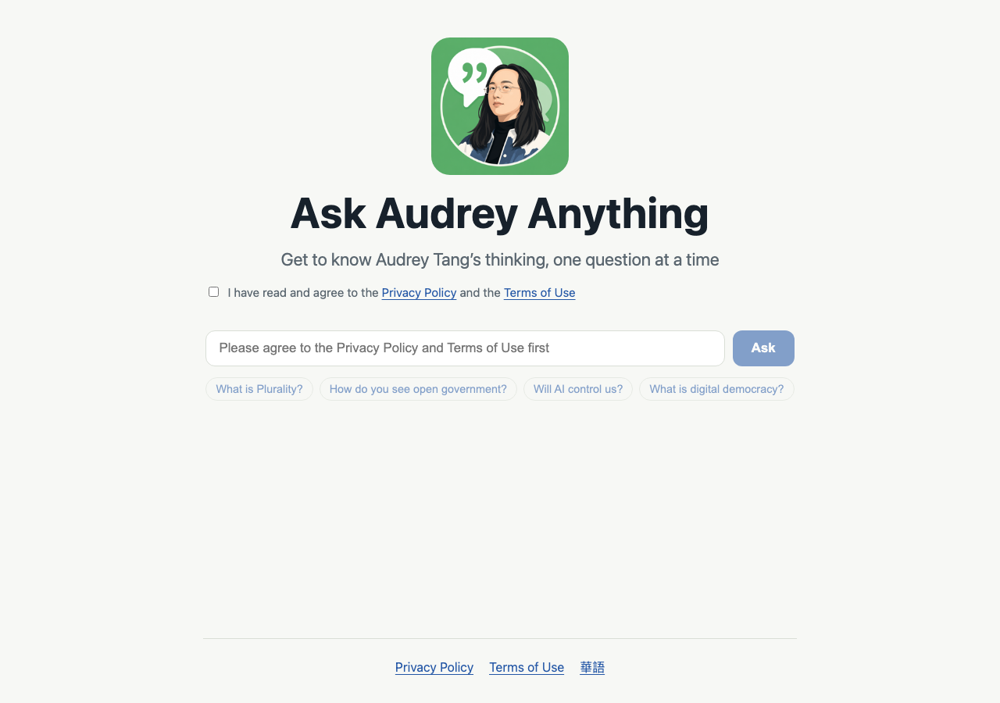
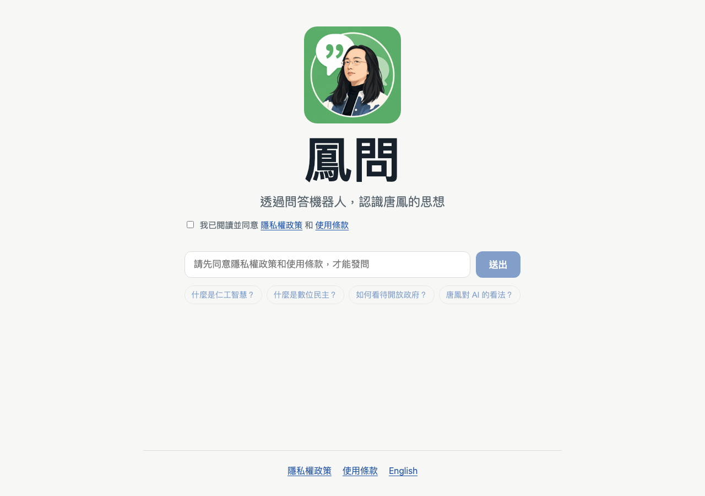
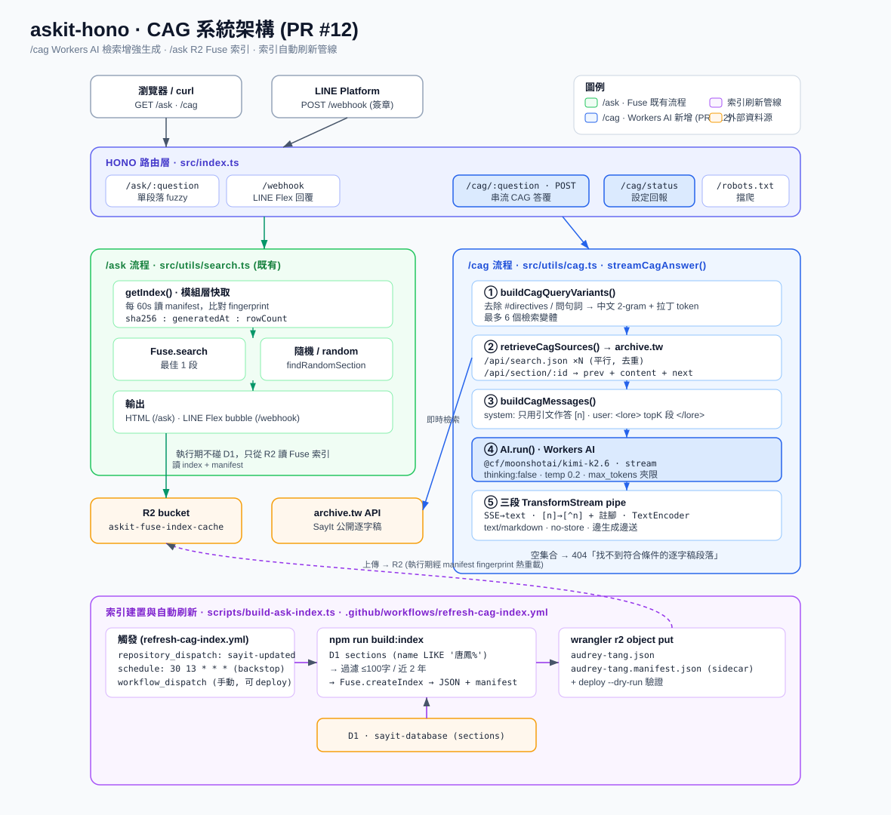

# 鳳問 · Ask Audrey

[](https://github.com/bestian/askit-hono/actions/workflows/ci.yml)
[](LICENSE)

**English | [華語](README.zh-TW.md)**

Ask Audrey — AI answers grounded in Audrey Tang's 30-year public
transcript archive ([archive.tw](https://archive.tw)), with every answer cited
back to its original source.

**Try it → <https://ask.archive.tw/en>** (華語: <https://ask.archive.tw>) ·
Also available as a LINE bot.

| English (`/en`) | 華語 (`/`) |
| --- | --- |
|  |  |

## How it works



- **Retrieval** — questions are embedded with `@cf/google/embeddinggemma-300m`
  (768-dim) and matched against the Vectorize index `askit-audrey-tang`
  (cosine); hits are hydrated through the archive.tw section API for
  surrounding context. If the Vectorize binding is missing, retrieval falls
  back to archive.tw full-text search; an empty Vectorize result falls back
  only for Latin-script questions (the index covers the 華語 transcripts),
  while 華語 questions get an honest "outside the archive" reply.
- **Generation** — Cloudflare Workers AI runs `@cf/google/gemma-4-26b-a4b-it`
  (pinned in `src/utils/cagEval.ts`); `[1]`-style markers are rewritten to
  `[^1]` footnotes linking to `archive.tw/<speech>#s<section_id>`.
- **LINE bot** — webhooks must ack within 2 s, so replies are three-stage:
  immediate `200 OK` (work moves to `waitUntil`), a typing indicator via
  `chat/loading/start`, then a single Reply API call with a Flex Message
  (answer + up to four source cards). Falls back to the top-2 fuzzy-search
  sections if CAG fails. A quick character check answers questions that contain
  only English and symbols (no Han characters) in English — answer, the Flex
  source labels (`Source N` / `Visit`), and the fixed not-found / rate-limit /
  too-long replies. New followers get a bilingual welcome Flex message keyed on
  their LINE profile language (non-Chinese → English, otherwise Traditional
  Chinese); follows without a shared `userId` are acked silently.
- **Caching** — identical questions are served from a 7-day R2 answer cache
  (`X-Cache: HIT`); retrieval sources are cached in KV for 1 hour.
- **Abuse protection** — two-layer rate limiting (edge limiter 15 req/10 s
  per key, then a per-key Durable Object cooldown), a global generation
  budget (30/min, 1000/day), 30 s CPU cap, strict CSP and security headers.
  Rate-limit hits and over-long questions are logged to a D1 abuse log, and
  repeat offenders are auto-blacklisted (default: 3 events in 24 h → `403`);
  unbind `ABUSE_DB` and it degrades gracefully (no log, empty blacklist).
  LINE events with no per-source identity (a 1:1 user who didn't share a
  `userId`, so they can't be rate-limited or blacklisted) are acked and
  dropped; groups/rooms keep their `groupId`/`roomId` and respond normally.
- **Quality** — an offline eval harness (`npm run eval:cag`,
  `npm run eval:cag:depth`) scores answer depth and grounding before model
  or retrieval changes ship.

## Routes

| Route | Purpose |
| --- | --- |
| `GET /` | 鳳問 web app (華語); returning visitors who saved an English preference are redirected client-side to `/en` |
| `GET /en` | Ask Audrey web app (English); a saved 華語 preference redirects back to `/` (client-side) |
| `GET /privacy` · `GET /terms` | Legal pages, 華語-first (`/en/privacy` · `/en/terms` are English-first twins) |
| `GET /cag/status` | Current retriever, archive base URL, model and top-k caps |
| `GET /capacity` | Coarse global generation status (`{ "status": "available" \| "busy" \| "full" }`); read-only, short-cacheable |
| `GET /cag/:question` | Streaming Markdown answer with footnote citations (params via query string, e.g. `?top_k=6&lang=en`) |
| `GET /ask/:question` | Debug: closest single transcript section via the R2 Fuse index |
| `POST /webhook` | LINE Messaging API webhook (three-stage async reply) |

## Deploy your own

Requires Node.js 22 or newer (Wrangler 4.87+ requires Node 22; `.nvmrc` and
`.node-version` are included for common version managers).

```bash
npm install
npx wrangler login   # first run opens a browser for OAuth
```

### 1. Create the R2 buckets

The Fuse index lives in `askit-fuse-index-cache` (with a `-preview` twin for
`wrangler dev`); the answer cache uses a separate `askit-answer-cache` bucket
(the code degrades gracefully — treats reads as cache misses — if a bucket is
missing):

```bash
npx wrangler r2 bucket create askit-fuse-index-cache
npx wrangler r2 bucket create askit-fuse-index-cache-preview
npx wrangler r2 bucket create askit-answer-cache
npx wrangler r2 bucket create askit-answer-cache-preview
npm run r2:lifecycle   # apply the 7-day lifecycle rule to the answer-cache buckets
```

### 2. Create the Vectorize index

```bash
npm run vectorize:create   # askit-audrey-tang, 768 dimensions, cosine
npm run vectorize:sync     # backfill embeddings from the transcript archive
```

### 3. Create the KV namespace

The retrieval-source cache (1 hour TTL) lives in KV:

```bash
npx wrangler kv namespace create CAG_CACHE
npx wrangler kv namespace create CAG_CACHE --preview
```

Put the printed ids into the `kv_namespaces` block of `wrangler.jsonc`.

### 4. Build the Fuse index and upload it to R2

```bash
npm run build:index
```

Optional environment variables:

| Var | Default | Notes |
| --- | --- | --- |
| `D1_DATABASE` | `sayit-database` | D1 database name (must match sayit-hono) |
| `SPEAKER_LIKE` | `唐鳳%` | `speakers.name LIKE` condition |
| `R2_BUCKET` | `askit-fuse-index-cache` | Target R2 bucket |
| `R2_KEY` | `ask-index/audrey-tang.json` | R2 object key |
| `R2_MANIFEST_KEY` | `ask-index/audrey-tang.manifest.json` | Tiny sidecar manifest key, uploaded only after the index JSON succeeds |
| `MAX_SECTION_CHARS` | `175` | Keep sections whose plain-text length is at most this value |
| `YEARS_BACK` | `2` | Keep transcripts from the last N years |
| `LOCAL=1` | — | Use `--local` against D1 (defaults to `--remote`) |
| `SKIP_UPLOAD=1` | — | Write the JSON to `build/` only, skip the R2 upload |

Upload order is "large index JSON first, manifest second." The Worker treats
the manifest as the version signal, so it does not switch before R2 has the
new index object.

### 5. LINE webhook setup (optional)

Only needed if you want the LINE bot; the web app works without it.

<details>
<summary>LINE webhook setup</summary>

Two secrets are required:

| Name | Purpose |
| --- | --- |
| `LINE_CHANNEL_ACCESS_TOKEN` | Bearer token used when calling the LINE Reply API |
| `LINE_CHANNEL_SECRET` | HMAC-SHA256 key used to verify webhook request signatures |

Both are sensitive — **do not** put them in `wrangler.jsonc` or commit them.
Upload them to your Cloudflare account (production does *not* read
`.dev.vars`):

```bash
npx wrangler secret put LINE_CHANNEL_ACCESS_TOKEN
npx wrangler secret put LINE_CHANNEL_SECRET
```

Each prompts for the value — paste and press Enter. Cloudflare stores it
encrypted and injects it at runtime as `c.env.LINE_CHANNEL_ACCESS_TOKEN` /
`c.env.LINE_CHANNEL_SECRET`. Verify with `npx wrangler secret list`; re-run
`secret put` to overwrite. (Secrets attach to a *deployed* Worker, so in
practice you `npm run deploy` once first; until they are set, webhook calls
return `401`.)

To obtain the values:

1. Open [LINE Developers Console](https://developers.line.biz/) and create a
   Provider + Messaging API Channel
2. **Channel secret**: shown on the channel's **Basic settings** tab — copy it
3. **Channel access token**: on the **Messaging API** tab, scroll to the
   bottom and **Issue** a long-lived **Channel access token**

After deploy, take the printed Worker URL, append `/webhook` (e.g.
`https://askit-hono.YOUR-SUBDOMAIN.workers.dev/webhook`), paste it into the
**Webhook URL** field of your channel, and enable the webhook. Click
**Verify** on that page to confirm signature verification works end-to-end.

How verification works: LINE computes HMAC-SHA256 over the raw request body
using your Channel secret, Base64-encodes it, and sends it in the
`x-line-signature` header. The Worker recomputes the MAC with the same key
and compares them in constant time. Mismatches (including a missing header)
return `401 Invalid signature`.

To test the webhook with `curl`:

```bash
SECRET="your-channel-secret"
BODY='{"events":[]}'
SIG=$(printf '%s' "$BODY" | openssl dgst -sha256 -hmac "$SECRET" -binary | base64)

curl -X POST https://YOUR-WORKER-URL/webhook \
  -H "Content-Type: application/json" \
  -H "x-line-signature: $SIG" \
  -d "$BODY"
```

An empty `events` array returns `200 OK`. `/webhook` always acks within 2 s
and does the slow work in `ctx.waitUntil`, so a faked `replyToken` only logs
a background Reply failure — to verify real replies, message the bot from the
LINE app.

</details>

### 6. Deploy

```bash
npm run deploy
```

### Keeping the index fresh

This repo includes `.github/workflows/refresh-cag-index.yml` to refresh the
R2 Fuse index used by `/ask` and the LINE fallback. `/cag` reads the
archive.tw APIs directly, so it sees new content once `sayit-hono` deploys.
The workflow has three entrypoints:

- `repository_dispatch` event `sayit-updated`: intended for the `transcript`
  repo after Markdown upload and `sayit-hono` deploy succeed.
- `workflow_dispatch`: manual index refresh; set `deploy=true` to deploy the
  Worker too as an immediate cache reset.
- Daily schedule: a backstop if a dispatch is missed.

Recommended final step in the `transcript` repo's `Sync markdown on push`
workflow, after the `rebuild-search-index` job deploys `sayit-hono`:

```yaml
- name: Refresh AskIt index
  env:
    GH_TOKEN: ${{ secrets.ASKIT_REBUILD_TOKEN }}
  run: |
    gh api repos/bestian/askit-hono/dispatches \
      -f event_type=sayit-updated \
      -F client_payload[transcript_sha]="${GITHUB_SHA}"
```

`ASKIT_REBUILD_TOKEN` must be able to send repository dispatches to
`bestian/askit-hono`; a fine-grained PAT with `Contents: read/write` for that
repo works. Once the dispatch arrives, askit-hono runs `npm run build:index`,
uploads the refreshed R2 index and manifest, then dry-run validates the
Worker bundle. The live Worker sees the manifest change and reloads the
`/ask` index within roughly one minute; deploy is kept only as a manual
cache reset.

## Local development

```bash
cp .dev.vars.example .dev.vars   # only needed for /webhook (LINE secrets)
# Edit .dev.vars and paste real values

npm run dev        # local Worker + remote R2 / Workers AI bindings
npm run preview    # wrangler dev --remote — the Worker itself also runs on Cloudflare
```

> Note: `ASK_INDEX` and `AI` are marked `remote: true` in `wrangler.jsonc`.
> Local `/ask` tests read the cloud preview R2 bucket; local `/cag` tests
> call `archive.tw` APIs and Workers AI. That uses your Cloudflare account
> quota. If the preview bucket does not have the `/ask` index yet, seed it
> first:

```bash
npx wrangler r2 object put 'askit-fuse-index-cache-preview/ask-index/audrey-tang.json' \
  --file build/audrey-tang.json \
  --content-type 'application/json; charset=utf-8' \
  --remote
npx wrangler r2 object put 'askit-fuse-index-cache-preview/ask-index/audrey-tang.manifest.json' \
  --file build/audrey-tang.manifest.json \
  --content-type 'application/json; charset=utf-8' \
  --remote
```

You can hit `/ask/:question` directly while developing:

```bash
curl 'http://127.0.0.1:8787/ask/AI%E6%9C%83%E4%B8%8D%E6%9C%83%E6%8E%A7%E5%88%B6%E6%88%91%E5%80%91'
```

Streaming CAG test:

```bash
curl -N 'https://YOUR-WORKER-URL/cag/%E7%94%A8%20%23zh-tw%20%E5%9B%9E%E7%AD%94%EF%BC%9A%E5%9C%B0%E7%A5%9E%E9%A6%99%E7%81%AB%E5%A6%82%E4%BD%95?top_k=6'
```

## Scripts

| Script | What it does |
| --- | --- |
| `npm run dev` / `npm run preview` | Local Worker (remote R2/AI bindings) / fully remote |
| `npm run deploy` | Deploy to Cloudflare Workers |
| `npm test` / `npm run typecheck` | Node test suite / TypeScript check |
| `npm run build:index` | Build the Fuse index from D1 and upload to R2 |
| `npm run vectorize:create` / `vectorize:sync` | Create / backfill the Vectorize index |
| `npm run eval:cag` / `eval:cag:depth` | Model / retrieval-depth eval harnesses |
| `npm run r2:lifecycle` | Apply the 7-day lifecycle to the answer-cache buckets |
| `npm run abuse:db:create` / `abuse:db:init` | Create / initialise the `askit-abuse-log` D1 database (`:local` for dev) |
| `npm run abuse:report` | Analyse the abuse log into `build/abuse-report.html` (`LOCAL=1` for local D1) |
| `npm run abuse:unban -- <key>` | Remove a key from the blacklist (also clears its old log entries) |
| `npm run tail` | Live-tail Worker logs |

## Project structure

```
.
├── src/
│   ├── index.ts                   # Hono app: routes, webhook, rate limiting
│   ├── pages/                     # Server-rendered pages (home/privacy/terms, zh + en)
│   └── utils/
│       ├── cag.ts                 # CAG retrieval + generation + citations
│       ├── vectorize.ts           # Embeddings + Vectorize query
│       ├── cagCache.ts            # KV source cache (1 h)
│       ├── cache.ts               # R2 answer cache (7 days)
│       ├── cagEval.ts             # Eval scoring (incl. pinned model id)
│       ├── abuse.ts               # D1 abuse log + auto-blacklist (issue #27)
│       ├── notFoundReply.ts       # Out-of-scope replies (plain + HTML, zh + en)
│       ├── search.ts              # R2 Fuse index loader + fuzzy search
│       └── askIndexFormat.ts      # Shared index types/options
├── public/                        # Static assets + Vue front-end (app.js)
├── db/                            # D1 schema for the abuse log + blacklist
├── scripts/                       # build-ask-index / vectorize-sync / evals / abuse ops
├── test/                          # node --test suites
├── design/                        # Architecture notes + system diagram
├── config/                        # R2 lifecycle rules
└── wrangler.jsonc                 # Workers config (R2, KV, Vectorize, AI, DO)
```

## Related projects

- [sayit-hono](https://github.com/bestian/sayit-hono) — the archive.tw backend this bot retrieves from
- [transcript](https://github.com/audreyt/transcript) — the source transcripts

## Contributing & security

See [CONTRIBUTING.md](CONTRIBUTING.md) and [SECURITY.md](SECURITY.md).

## License

[MIT](LICENSE) © bestian
